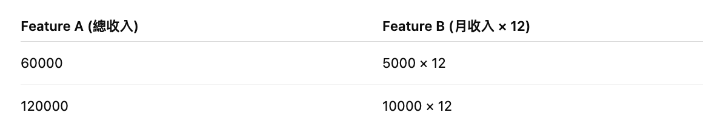

# Logistic Regression
## 起源背景
Logistic Regression 最早並不是作為機器學習模型誕生的，而是源自統計學，特別是在 生物統計（Biostatistics）與社會科學 領域，用來建模「某事件發生的機率」。

1838 年，數學家 Pierre François Verhulst 提出 logistic function，用來描述人口成長的飽和曲線（Verhulst 模型

Logistic function 公式：
​f(x)= 1 / (1 + e^(-x))
它具有「S型曲線」，能將任意實數壓縮到 (0,1) 的範圍，非常適合用來預測「事件發生的機率」。

1958 年，David Cox 正式提出了「Logistic Regression」的框架（也是 Probit Regression 的推廣），被用來解釋二元分類問題，例如病人是否生病、產品是否會被購買等。

它的核心思想是：用線性組合的輸入變數來預測一個事件的機率，並用邏輯函數來壓縮輸出值。

## 與 Linear Regression 的區別與演進
線性回歸（Linear Regression）預測的是連續數值，無法處理「類別型」結果，且容易讓機率預測超出 0~1 範圍。

Logistic Regression 解決了這個問題，透過 log-odds（對數機率）轉換，讓預測落在合理區間內。

📈 在統計到機器學習的過渡
Logistic Regression 長期以來在統計學、經濟學、醫學研究中被廣泛應用。

隨著電腦與資料量的提升，它也成為了 最早應用在機器學習領域的分類模型之一。

🧠 當前地位
儘管現今有更多複雜模型（如決策樹、深度學習），但 Logistic Regression 仍因其：
模型簡單易懂（可解釋性強）
效能穩定（尤其在特徵工程良好時）
訓練速度快
而成為資料科學與機器學習的 入門首選模型，也常作為 baseline 模型使用。

📚 參考紀錄與貢獻人物
Pierre Verhulst（1838）：logistic function 的提出者
David Cox（1958）：將 logistic function 引入統計建模，發展成 logistic regression
Ronald Fisher：早期將最大概似估計（MLE）引入統計建模，也是 logistic regression 常用的參數估計法

## 什麼需要Logistic Regression？
Logistic Regression 主要是要預測機率 —— 而機率只可能落在 0 到 1 之間。
這就是為什麼不管你的特徵組合（線性或非線性）怎樣變動，我們都會把它丟到 sigmoid 函數裡做轉換，來確保輸出能當作機率。
Logistic 函數就像是個「機率壓縮器」，能把你丟進來的任意數字轉換成一個合理的機率，這個性質是 Logistic Regression 能成為分類模型的核心原因。

## 從二元分類走向多類別分類
當 Logistic Regression 面對多類別分類
標準的 Logistic Regression 是設計來解決 二元分類問題（例如是/否、成功/失敗、正面/負面）。
但如果有 三類、五類甚至更多的類別，我們不能單靠一條 sigmoid 函數來區分了。

這時候我們需要一種 多類別擴展 —— 它叫做：
Softmax Regression（又稱 Multinomial Logistic Regression）
🚧 核心想法
對於 K 個類別，我們建立 K 個線性模型：

接著，我們用 Softmax 函數 來把這些線性分數轉換成「每個類別的機率」：


這會保證所有類別的機率：
- 都在 [0,1]
- 並且加起來是 1（符合機率定義）

假設有三個類別：「狗 🐶」、「貓 🐱」、「鳥 🐦」，對於一筆特徵 x，模型輸出的 logits（分數）為：
z=[3.0,1.0,0.1]
經過 Softmax：


最後會選擇機率最高的類別作為預測。

在 sklearn 中，只要你用：
``` python 
LogisticRegression(multi_class='multinomial', solver='lbfgs')
```
它就會自動用 softmax regression（也叫 multinomial logistic regression）來處理多類分類問題。
類別的 logistic regression 就是將 sigmoid 擴展為 softmax，讓每個類別都能獲得對應的機率，再從中挑出最有可能的類別。

## Logistic Function 的數學理論與推導
1. 問題背景：為什麼需要 Logistic Function？
在二元分類問題中，我們想根據一組輸入 x 預測對應的類別 y∈{0,1}。

線性回歸是這樣做的：
但這樣的輸出是任意實數，不適合當作機率！
我們希望：y=1 時，預測機率高；y=0 時，預測機率低；
輸出值落在 [0, 1] 之間，可當機率解釋。
所以我們引入了 sigmoid 函數 來壓縮輸出：
2. Logistic（Sigmoid）函數定義

這樣就能把實數 z∈(−∞,∞) 壓縮到：

3. 機率解釋：從 odds 到 log-odds
我們從機率的角度來看，設：

那對應的 odds（賠率） 是：

然後取對數稱為 log-odds（又叫 logit）：

這裡的核心假設是：log-odds 是線性的。
再反過來解 p，我們就會得到：

這就是 logistic regression 的核心公式！

4. 總結：Logistic Regression 模型


5. 損失函數（Loss Function）
Logistic Regression 的學習目標是最小化「錯誤預測的機率」，所以我們用 對數似然函數（log-likelihood）：

對於一筆資料 (x i,y i)，機率模型為：


對數化後取負變成損失函數（cross-entropy）：

這就是模型訓練時要最小化的函數。

6. 梯度（Gradient）
為了訓練模型，我們用 梯度下降法：


這是因為 sigmoid 的導數公式非常漂亮：


這讓 Logistic Regression 的學習過程既可解釋又好實作。

🎯 總結邏輯流程圖：


## 為什麼需要「損失函數」和「梯度下降」？
在 Logistic Regression 中，我們需要一個「損失函數」來衡量模型預測的好壞，有了損失函數，我們現在要找到一組 w,b，讓這個損失最小。
但這個損失函數無法用代數直接解出最小值，只能用數值方法逼近 —— 也就是：梯度下降法（Gradient Descent）來優化模型參數。

✔️ 損失函數：訓練用，幫助模型找出最佳參數
✔️ 評估指標（如精準度）：驗收用，用來評估模型的成果好不好


## 1. 如何「算出損失對每個參數的偏導數（梯度）」？


### 那怎麼對 損失函數 L(w,b) 求導數？
這要用 鏈式法則（Chain Rule），我們來一步步看：
對 w 求偏導：

意思是：每一筆資料的「預測誤差」乘上該樣本的特徵 x i，然後全部加總。
對 b 求偏導：


也就是每一筆資料的預測誤差累加起來。
這樣，我們就得到了損失函數對參數的 梯度（偏導數）。

## 2. 什麼叫 “沿著損失函數下降最快的方向往下走”？
這句話來自數學上的概念：

函數的梯度（Gradient）指向上升最快的方向，
所以反方向（負梯度）就是下降最快的方向。

📉 你可以想像這樣：
想像你在一座山上（這座山是「損失函數曲面」），你想往山谷（最低點）走：

梯度會告訴你山坡「上坡的方向」

那你就往「反方向」走，這就是下降最快的路！

更新參數的公式：

其中 η 是學習率（learning rate），控制走的步伐大小。

## 損失函數
損失函數是一個通用的工具，可以應用在幾乎所有機器學習模型中，
幫助我們「衡量模型預測好不好」，並「指導參數怎麼更新」。

🎯 更完整說法如下：
1️⃣ 損失函數可以用來「訓練各種模型」
無論你是：
線性回歸 → 用 均方誤差（MSE）
logistic regression → 用 交叉熵（cross-entropy）
神經網路 → 各種任務也用 MSE、cross-entropy…
支援向量機（SVM）→ 有自己的 hinge loss
這些模型都 設計損失函數 來評估「預測 vs 真實的落差」。

2️⃣ 梯度下降也是一個「通用的最佳化方法」
只要你的模型參數是連續值、損失函數可微分，
那麼你就能用梯度下降法來調整參數。

額外補充：損失函數 ≠ 評估指標


舉例：
Logistic Regression 用交叉熵來訓練，但用 precision/recall 來驗收。
Neural Network 用 MSE 或 cross-entropy 訓練，但最後看的是準確率。

✔️ 損失函數與梯度下降是一套通用的訓練機制，
✔️ 只要你的模型是可導、參數可更新，都可以套用這套方法。

## 不同任務下的常見損失函數

✅ 原因一：資料類型不同
數值 → 用 MSE/MAE
類別 → 用 Cross-Entropy
機率/機器人信心 → 用 log 來處理（交叉熵）

✅ 原因二：對錯誤的懲罰邏輯不同
MSE 懲罰大誤差更重（平方）
MAE 對大錯誤「一視同仁」
Cross-Entropy 懲罰錯得「太有信心」的情況（如 0.99 預測錯）

✅ 原因三：數學性質需可微（可套入梯度下降）
所有損失都需能「對參數求導數」
比如 accuracy 無法做為訓練指標，因為它不是可導函數

實例比較：用 Logistic Regression 分類與用 Linear Regression 做回歸


延伸：可以自訂損失函數嗎？
當然可以！像下列情境常用自訂損失函數：
多目標訓練（結合分類 + 回歸）
不平衡資料（加權損失）
特殊任務（如 style transfer）

不同任務的損失函數設計，是根據「任務特性」+「預測誤差的處理邏輯」來選的，
它是模型能學會好參數的關鍵。

## 學習率（Learning Rate, 簡寫為 η 或 α）
學習率（Learning Rate, 簡寫為 η 或 α）本身不是計算出來的數值，而是「你手動設定」的一個超參數（hyperparameter），用來控制模型參數更新的速度
### 如何「選擇」學習率？


## 多類別邏輯斯回歸（Multinomial Logistic Regression）
Softmax 函數（輸出每類別的機率）：


Cross-Entropy Loss（多類別）：


## 數據分析及優化
- 自定義的二分類 Logistic Regression 模型（LogisticRegressionCustom）結果：

✅ 1. 增加訓練迭代次數（n_iterations）
如果你目前迭代數不多（例如 <1000），模型可能尚未收斂。
```python
model = LogisticRegressionCustom(learning_rate=0.05, n_iterations=3000)
```
✅ 2. 標準化特徵（你已經用 Z-score，繼續保持）
標準化可避免某些特徵值太大導致 sigmoid overflow 或訓練不穩。

✅ 3. 特徵選擇與創建（Feature Engineering）
嘗試加入交互特徵（如 x1 * x2）
加入平方項（非線性效果）
刪除對目標幾乎無貢獻的特徵（如低相關、共線特徵）

✅ 4. 加入正則化（防止 overfitting）
在你的自定義模型中加上 L2 正則化：
```python
# 更新 loss 時加上： + λ * np.sum(w ** 2)
# 更新 gradient 時加上：dw += λ * w
```
可讓模型學得更穩定、更泛化。

✅ 5. 調整閾值（threshold）
預設你可能是：
```python
y_pred = (sigmoid(z) > 0.5).astype(int)
```
但實際上，你可以調整這個 0.5 閾值來找最佳 F1 或 Recall：
```python
for t in np.arange(0.3, 0.7, 0.01):
    y_pred = (probs > t).astype(int)
    # 計算 precision, recall, f1
```
這對 不平衡資料或 recall 偏低時特別有幫助！

✅ 6. 處理資料不平衡（如果有的話）
若正負類不平衡，模型可能偏向預測為多的那類。
處理方式：
加權 loss function（正類加重）
SMOTE 增加少數類樣本
下取樣多數類別

✅ 7. 加入早停與 Loss 曲線監控
你可以在訓練中監控 loss，每次記錄 loss 並畫圖，避免過度訓練。

可執行範例（針對提升 Recall & F1）
```python
# 增加迭代次數 + 較小學習率
model = LogisticRegressionCustom(learning_rate=0.01, n_iterations=3000)
model.train(x_train, y_train)

# 調整閾值
probs = model.sigmoid(np.dot(x_test, model.w) + model.b)
threshold = 0.45  # 嘗試比 0.5 小
y_pred = (probs > threshold).astype(int)

# 計算 recall, precision, f1
from sklearn.metrics import classification_report
print(classification_report(y_test, y_pred))
```


- 自定義的二分類 Logistic Regression 模型（LogisticRegressionCustom）結果：


如何提升表現？
✅ (A) 特徵處理與資料增強
標準化特徵（Z-score 已做得不錯，請確認所有特徵都一致處理）
進一步選擇有貢獻的特徵
用 PCA / LDA 降維後再訓練。
使用 feature importance 或 mutual information 排序特徵。
擴展資料量或合成資料（Data Augmentation）
若資料集偏小，可以考慮 SMOTE 或加倍樣本擴充。

✅ (B) 模型強化
增加訓練週期或調整學習率（你的 custom softmax 模型是否有提前停止？）
加入正則化（L2） 來避免 overfitting。
嘗試 polynomial 特徵轉換：
增加模型表達力（例如二次項、交乘項）。

嘗試 one-vs-rest（OvR）或 one-vs-one（OvO）分類策略。
預設 Softmax 是 multinomial loss；可試 OvR 方案比較表現差異。

✅ (C) 使用 ensemble 手法加強預測穩定性
雖然你是用 logistic regression，但可以用：
Bagging（隨機抽樣訓練數據）
Boosting（像 AdaBoost 搭配 LR）

實作補充
```python 
from sklearn.metrics import classification_report, confusion_matrix
print(classification_report(y_test, y_pred))
print(confusion_matrix(y_test, y_pred))
```
這可以幫你了解「哪些類別預測錯最多」，也許某幾類表現差拉低了整體指標。


[[109   0   0   0   0   2   1   0   1   0]  
 [  0 102   1   0   0   1   0   1   2   1]  
 [  1   2  74   7   1   1   3   2   1   1]  
 [  0   1   1 108   0   2   0   0   3   0]  
 [  0   2   0   0  83   0   1   0   0   2]  
 [  0   1   0   2   6  67   0   0   3   1]  
 [  0   1   1   0   0   1 102   1   1   0]  
 [  1   1   1   0   1   0   0  92   0   5]  
 [  0   1   2   2   1   5   1   2  74   1]  
 [  3   0   0   1   5   0   0   5   0  92]]    
混淆矩陣提供了非常寶貴的資訊，讓我們可以更精確地分析目前模型的瓶頸，並針對性地優化    
混淆矩陣總覽    
這是 10 類別的分類任務，混淆矩陣的每一行表示真實類別，每一列表示預測類別。理想情況下，對角線（正確預測）應該是高值，非對角線（錯誤預測）應該趨近 0。    


📌 問題聚焦：類別 2、5、8 是主要的失誤來源
原因可能：
這些類之間特徵分布重疊
資料不足或分佈不均
特徵提取不夠具區別性

🧠 優化建議
✅ 1. 特徵強化與選擇
對錯誤率高的類別（例如 2 類）：
用 PCA 或 t-SNE 視覺化資料點分布，找出區分困難的特徵組合
嘗試設計額外特徵，例如：
組合特徵（feature1 × feature2）
非線性特徵（平方、開根號、log 轉換等）

✅ 2. 類別加權或重抽樣
```python
from sklearn.utils.class_weight import compute_class_weight
weights = compute_class_weight('balanced', classes=np.unique(y_train), y=y_train)
```
在你的 Softmax 梯度計算中，手動加入 class_weight 可提升 recall 較低類別的表現。

✅ 3. 試試 one-vs-rest 訓練策略
將多類別問題拆解為一組組二分類問題，各類別會更「專注」，對於混淆嚴重的類型（如 2 vs 3）有幫助。

✅ 4. 資料清洗與資料量檢查
你可以針對類別 2 與 3 檢查是否有 錯標籤或資料稀疏問題

增加資料量或資料增強可減少 noise 對訓練的干擾

📊 補充工具：視覺化錯誤
```python
import seaborn as sns
from sklearn.metrics import confusion_matrix

sns.heatmap(confusion_matrix(y_test, y_pred), annot=True, fmt='d', cmap='Blues')
plt.xlabel('Predicted')
plt.ylabel('True')
plt.title('Confusion Matrix Heatmap')
plt.show()
```
這有助於快速觀察錯誤集中的區塊。

🎯 小結：你可以這樣做來接近 95%


## Logistic Regression 常見限制與錯誤
### 對線性可分性假設過強
🔍 問題說明：
Logistic Regression 假設數據點是線性可分的，也就是說可以用一條直線（或高維空間中的超平面）把不同類別分開。

❗ 例子：
假設你有一個像這樣的資料分布（XOR 問題）：


這種情況下 Logistic Regression 完全無法用一條線分開兩類。

✅ 解決方式：
加入 非線性特徵轉換（例如加入交乘項 x1*x2, 多項式轉換）。
使用 核方法（kernel trick） → 轉向 SVM。
使用更強大的模型（如：決策樹、隨機森林、神經網路等）。

### 特徵縮放影響訓練與收斂
問題說明：
特徵之間的尺度差異過大，會讓梯度下降時跳動劇烈，導致收斂困難或不穩定。

年齡與收入的尺度差異很大，這會讓學習算法偏向關注收入。

✅ 解決方式：
使用 Z-score 標準化 或 MinMaxScaler。
用 sklearn 中的 StandardScaler 處理數據。

### 多重共線性問題（Multicollinearity）
問題說明：
如果某些特徵彼此高度相關（線性相關），會導致模型的係數不穩定，增加方差、降低模型解釋力。

兩個特徵本質上是相同資訊。

✅ 解決方式：
進行 特徵選擇或降維（如 PCA）
移除高度共線性的特徵（用相關係數、VIF 檢測）。
考慮加入 正則化（L2 Ridge），可以降低共線性問題影響。

### 模型過於簡單（無法處理複雜關係）
問題說明：
Logistic Regression 無法擬合非線性邊界，也無法自動學習到深層次特徵或高維特徵交互關係。

❗ 例子：
如果你要辨識圖片中的狗與貓，只用像素 RGB 值當作輸入，Logistic Regression 幾乎無法學習到有用的模式。

✅ 解決方式：
加入非線性特徵（手動特徵工程）。
使用 非線性模型：
決策樹 / 隨機森林
Gradient Boosting（XGBoost, LightGBM）
神經網路（DNN, CNN）
在前處理階段做更多特徵選取與擴展。

### 補充常見錯誤與提醒：


### 總結與建議
Logistic Regression 的優點是 可解釋性高、收斂穩定、計算效率好，但其本質是一個 線性模型，在處理複雜非線性問題上會顯得力不從心。因此：

若資料結構明確，線性分類邊界可行，Logistic Regression 是首選。

若有非線性特徵關係、特徵多維、或需更高準確率，請考慮升級模型。

## 實用書籍與論文
1. 《Pattern Recognition and Machine Learning》 - Christopher Bishop
📌 優點：深入數學理論，包括 Logistic Regression 與對數似然推導、貝葉斯擴展等。
✅ 適合你如果想知道 logistic regression 背後的理論如何與統計學與機器學習整合。

2. 《An Introduction to Statistical Learning》 – Gareth James et al.
📌 優點：大量 R/python 實作示範，邏輯迴歸講解淺顯易懂。
✅ 適合你如果想邊學邊做專案，理解交叉驗證、模型評估、與類別資料預測。

3. 《The Elements of Statistical Learning》 – Hastie, Tibshirani, Friedman
📌 優點：進階理論，包含 GLM（廣義線性模型）、正則化（L1/L2）、分類邊界等。
✅ 適合你當作參考工具書，並了解 logistic regression 與其他模型（如 SVM、決策樹）比較。

## 論文
1. "The Use of the Logistic Function in Regression Analysis" – David W. Hosmer (1972)
📌 經典論文，解釋為何 logistic function 適合處理二元資料，與其機率詮釋意義。

2. "Maximum Likelihood Estimation in Logistic Regression Models" – A. Albert, J. Anderson (1984)
📌 從統計學角度出發，說明對數似然推導與參數估計技巧。

3. 醫療領域應用實例：
Hosmer, Lemeshow, and Sturdivant, “Applied Logistic Regression” 附錄中常引用臨床資料來預測疾病風險，如癌症、糖尿病預測等。

4. 影像處理與深度學習擴展
"Logistic Regression as a Shallow Neural Network"

📌 幫助你理解 Logistic Regression 與神經網路關係，作為過渡理解 softmax 與多層感知機（MLP）。

## 延伸主題與進階研究
1. 多類別 Logistic Regression（Softmax Regression）
應用於手寫數字辨識（MNIST）、影像分類等。

2. 正則化技術（L1, L2, Elastic Net）
解決過擬合問題，尤其特徵數量大時，例如：

L1（Lasso）：會讓某些參數變成 0，達到特徵選擇效果。

L2（Ridge）：控制參數大小，避免模型過度學習訓練資料。

3. Logistic Regression 與深度學習的關係
Logistic regression 是單層神經網路的最簡形式。

是理解 CNN、Transformer 分類任務中 最後一層 softmax/sigmoid 的基礎。

4. 廣義線性模型（Generalized Linear Models, GLM）
Logistic Regression 是 GLM 中針對二分類的特例。

5. 貝葉斯 Logistic Regression
使用貝葉斯方法來建構後驗分布，可以得到參數不確定性。

## 實際應用領域
應用領域	實例	優點
醫療分析	癌症早期預測、心血管風險分類	模型可解釋性高
信用評分	銀行信用卡申請核准預測	常與 AUC/ROC 搭配
工業異常檢測	設備故障是否會發生	搭配時間序列
人才篩選	招聘是否錄取、學業預測	可結合社會調查資料

## 工具推薦（資料實驗）
- scikit-learn + seaborn + pandas
- statsmodels：可以看係數、p-value，更偏向統計檢定用途
- PyMC3 / PyMC：做 Bayesian Logistic Regression

## 實際Excell 範例
[羅吉斯迴歸分析(Logistic regression, logit model)-統計說明與SPSS操作](https://www.yongxi-stat.com/logistic-regression/)

## Issues Tracking
- 如果資料數值太大會有這個錯誤：RuntimeWarning: overflow encountered in exp return 1 / (1 + np.exp(-z))
根本原因是 np.exp(-z) 中的 z 絕對值太大了，導致指數爆炸（數值超出浮點範圍）。這是 logistic/sigmoid 函數在實作時很常遇到的數值穩定性問題。
方法 1：對 sigmoid 函數做數值穩定處理（首選推薦）
使用 NumPy 的 clip 函數限制 z 的最大最小值：
```python
def sigmoid(z):
    z = np.clip(z, -500, 500)  # 防止 z 太大或太小
    return 1 / (1 + np.exp(-z))
```
這樣可以避免爆炸性的 exponent 計算錯誤。±500 是經驗值，因為超過這個值後 sigmoid 的輸出幾乎已經是 0 或 1。
方法 2：特徵標準化（Standardization）
若輸入 x_train 的值本身就非常大（例如原始 pixel 值、金錢、次方），會造成 z=w⋅x+b 絕對值變得很大。
解法：使用 Z-score 標準化（均值為 0，標準差為 1）：

``` python
from sklearn.preprocessing import StandardScaler

scaler = StandardScaler()
x_train_scaled = scaler.fit_transform(x_train)
x_test_scaled = scaler.transform(x_test)
```
這應該在訓練前就做。

方法 3：特徵篩選與降維（你說的建議）
你提到的這個想法是正確的，但不是第一步要做的事。只有在：
特徵太多（導致過擬合或訓練效率低）
特徵之間高度相關（共線性）
有非常不重要的特徵

才需要進行：
特徵選擇（如 SelectKBest, L1, RandomForest, mutual information）
特徵降維（如 PCA）
但這無法直接解決 overflow 問題，只能間接幫助。
建議順序
✅ 先在 sigmoid(z) 中加上 np.clip(z, -500, 500)（最直接有效）
✅ 接著對 x_train, x_test 做 StandardScaler
🔁 若還有效能問題，再考慮特徵降維或篩選

## Reference 
(機器學習基石系列(8) — 利用線性模型解決分類問題)[https://medium.com/%E6%A9%9F%E5%99%A8%E5%AD%B8%E7%BF%92%E5%9F%BA%E7%9F%B3%E7%B3%BB%E5%88%97/%E6%A9%9F%E5%99%A8%E5%AD%B8%E7%BF%92%E5%9F%BA%E7%9F%B3%E7%B3%BB%E5%88%97-8-%E5%88%A9%E7%94%A8%E7%B7%9A%E6%80%A7%E6%A8%A1%E5%9E%8B%E8%A7%A3%E6%B1%BA%E5%88%86%E9%A1%9E%E5%95%8F%E9%A1%8C-f058c398514e]