# Support Vector Machine (SVM) for Classification
- Hard Margin SVM (Maximum Margin SVM)
完全不允許誤分類
僅適用於 完全線性可分 的資料
尋找一個使 margin 最大化的超平面
- Soft Margin SVM (with slack variables)
容許部分樣本違反 margin 條件
透過 slack variables ξi​ 控制每個樣本的違反程度
適用於 線性不可分或含噪聲資料
- Kernel SVM (using kernel functions for non-linear classification)

##  Introduction
在機器學習的眾多模型中，SVM（Support Vector Machine，支援向量機）一直是分類問題中表現優異、且理論基礎深厚的經典方法之一。本篇文章將從基礎理論談起，逐步介紹 kernel method、SVM 的歷史、數學推導、實作方式、應用場景、與其他模型的比較，並補充實務上常見的錯誤與限制，幫助你全面理解這個強大的分類工具。

## SVM 的歷史由來
SVM 的理論由 Vladimir Vapnik 與 Alexey Chervonenkis 在 1960 年代提出，並於 1995 年由 Cortes & Vapnik 發表經典論文《Support-Vector Networks》正式進入主流機器學習視野。自此之後，SVM 被廣泛應用於文本分類、人臉辨識、影像辨識等領域。

## 什麼是 Kernel Method？
Kernel 方法是一種透過非線性映射將低維特徵空間資料投影至高維空間，使得原本無法線性分離的資料在高維空間中變得可分。這個過程不需實際計算高維空間座標，而是透過 kernel function 來間接計算內積。

常見的 kernel 有：
線性核（Linear Kernel）：( K(x, x') = x^T x' \）
多項式核（Polynomial Kernel）：( K(x, x') = (x^T x' + c)^d \）
RBF 核（高斯徑向基）：( K(x, x') = \exp(-\gamma ||x - x'||^2) \）
Sigmoid 核：( \tanh(\alpha x^T x' + c) \）
Kernel 方法是 SVM 能夠應付非線性分類問題的核心技巧。

SVM 結合 Kernel 技術後，能夠在高維空間中尋找最大間隔（Margin）的超平面，來進行分類。這使得它在高維、非線性的情境下依然具有良好的泛化能力。

## 數學理論與公式推導
SVM 的目標是最大化分類邊界的 margin，同時容忍少量誤分類。其基本形式如下：
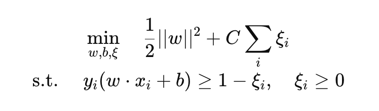

其中：
w：超平面法向量
b：偏差項
𝜉𝑖：slack variable，允許部分樣本違反 margin 條件
C：懲罰違規樣本的程度（regularization parameter）

在 dual form 中，會出現 Lagrangian multiplier 與 kernel function，方便應用非線性映射。

-----------------------------------
範例均為以下資料來講解：
𝑤 = [− 1 / 4, 1 / 4], b = - 1 /4
X = np.array([[1,8],[7,2],[6,-1],[-5,0], [-5,1], [-5,2],[6,3],[6,1],[5,2]])
y = np.array([1, -1, -1, 1, -1, 1, 1, -1, -1])

## Definitions
- decision boundary
Decision Boundary 是 SVM 用來區分不同類別的邊界。它是由超平面（hyperplane）定義的，並且將資料點分為兩個類別。對於二元分類問題，決策邊界可以用以下方程式表示：
  - 𝑤⋅𝑥 + 𝑏 = 0
  其中，𝑤 是權重向量，𝑥 是輸入特徵向量，𝑏 是偏置項。
- hyperplane
  - 在二維空間中，超平面就是一條直線。
  - 在三維空間中，超平面是一個平面。
  - 在更高維度中，超平面是 n-1 維的子空間。
  - 超平面可以用以下方程式表示：
    𝑤⋅𝑥 + 𝑏 = 0
    其中，𝑤 是權重向量，𝑥 是輸入特徵向量，𝑏 是偏置項。
- support vectors
Support Vectors 是剛好落在 margin 上的資料點，也就是那些滿足以下條件的樣本：
  - 𝑦𝑖(𝑤⋅𝑥𝑖 + 𝑏) = 1 （在 margin 邊界上）
或者在 soft-margin SVM 中，也包含：
  - 𝑦𝑖(𝑤⋅𝑥𝑖 + 𝑏) = 1 - 𝜉𝑖 （在 margin 內部，且 slack 變數 𝜉𝑖 > 0）
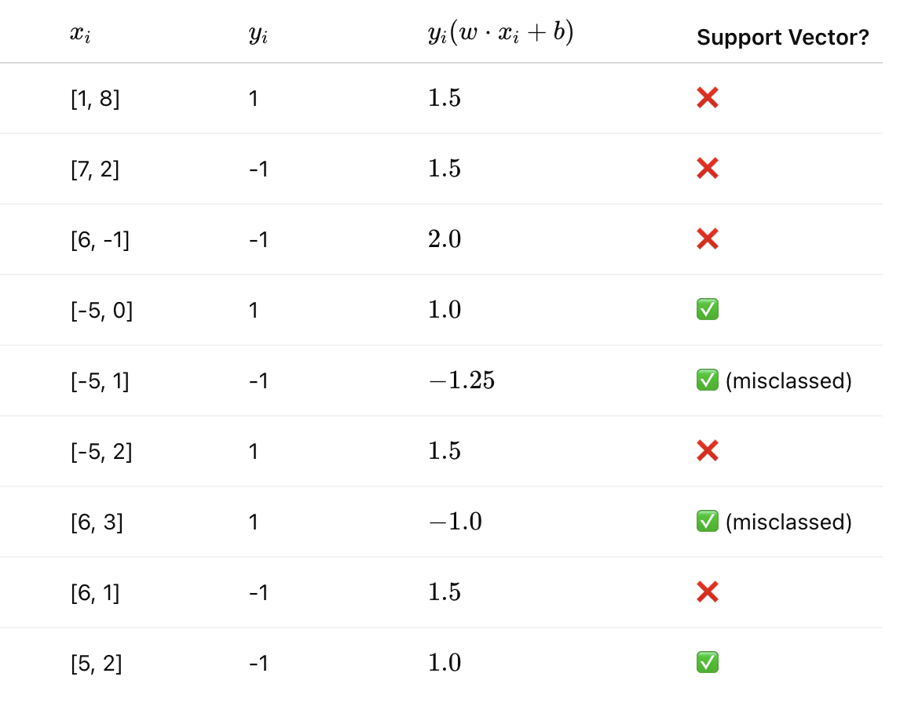    

  - out-boundary support vectors: 
    - 𝑦𝑖(𝑤⋅𝑥𝑖 + 𝑏) = 1 （在 margin 邊界上）(𝜉𝑖 ≥ 1)
    - 𝜉𝑖 = 0 （在 margin 外側，錯誤分類）
  - in-boundary support vectors:
    - 𝑦𝑖(𝑤⋅𝑥𝑖 + 𝑏) = 1 - 𝜉𝑖 （在 margin 內部，且 slack 變數 𝜉𝑖 > 0）
    - 𝜉𝑖 = 0 或是 0 < 𝜉𝑖 < 1 （在 margin 裡，或是在margin里可是正確分類）
Once you fit your SVM model, you can access:
``` python
nlsvm.support_vectors_         # All support vector coordinates
nlsvm.dual_coef_               # Dual coefficients (α_i * y_i), shape (1, n_support)
nlsvm.C                        # The regularization parameter C
```

To Classify:
``` python
import numpy as np

# Get indices of all support vectors
support_indices = nlsvm.support_

# Dual coefficients (signed)
dual_coefs = np.abs(nlsvm.dual_coef_[0])

# Support vectors at bound (alpha == C)
out_bound_mask = np.isclose(dual_coefs, nlsvm.C)
in_bound_mask = ~out_bound_mask

# Coordinates
in_bound_SVs = nlsvm.support_vectors_[in_bound_mask]
out_bound_SVs = nlsvm.support_vectors_[out_bound_mask]

print("In-bound Support Vectors:\n", in_bound_SVs)
print("Out-bound Support Vectors:\n", out_bound_SVs)
```

- margin boundaries
Margin= 2 / ∥w∥
​∥w∥ : norm of the weight vector w, L2 Euclidean norm
w is the weight vector perpendicular to the hyperplane (超平面的法向量)
For example: 
超平面法向量 
𝑤 = [− 1 / 4, 1 / 4], b = - 1 /4
∥w∥ = √((-1/4)² + (1/4)²) = √(1/16 + 1/16) = √(2/16) = √(1/8) = 1 / 2√2
margin = 2 / ∥w∥ = 2 / (1 / 2√2) = 4√2
​
- nonzero slack 鬆弛變量
是指某個訓練樣本違反了 margin 的條件，也就是說：
Slack 變數（記作 𝜉𝑖）是在 軟間隔（soft margin）SVM 中引入的，為了允許模型對於不完美可分的資料仍能建立分類邊界。

每一筆資料都有一個 slack 變數 𝜉𝑖，其含義如下：
𝜉𝑖 = 0：該點完全滿足 SVM 的 margin 條件，而且在邊界之外。
0 < 𝜉𝑖 < 1：該點在 margin 之內，但分類仍是正確的。
𝜉𝑖 ≥ 1：該點被錯誤分類（misclassified）
對每一筆資料點 (𝑥𝑖, 𝑦𝑖)，約束條件為：
    𝑦𝑖(𝑤⋅𝑥𝑖 + 𝑏) ≥ 1 - 𝜉𝑖, 𝜉𝑖 ≥ 0
=>  𝜉𝑖 = max(0, 1 - 𝑦𝑖(𝑤⋅𝑥𝑖 + 𝑏))
白話文：
當 𝜉𝑖 > 0, 
- 這筆資料：沒有在 margin 外側（不是理想 support vector）
- 有兩種可能情況：
0 < 𝜉𝑖 < 1：在 margin 裡，但沒越界
𝜉𝑖 ≥ 1：完全被分錯邊 → 錯誤分類
=> Nonzero slack 就是某筆資料的 slack 值 
𝜉𝑖 > 0，代表這筆資料落在 margin 裡面甚至被分類錯誤，模型為了整體最佳分類表現而「犧牲」它。
------------------------------------
For each data point (𝑥𝑖, 𝑦𝑖),  the constraint is:
    𝑦𝑖(𝑤⋅𝑥𝑖 + 𝑏) ≥ 1 - 𝜉𝑖, 
    where 𝜉𝑖 ≥ 0 is the slack variable for the i-th data point.
    if 𝜉𝑖 > 0, the point is either: 
    - inside the margin (but correctly classified)
    - misclassified
So, to find training points with nonzero slack, we compute for each point:
    margin condition = 𝑦𝑖(𝑤⋅𝑥𝑖 + 𝑏) < 1
If the margin condition is true, then 𝜉𝑖 > 0, meaning the point has nonzero slack.

``` python 
# 𝑤 = [− 1 / 4, 1 / 4], b = - 1 /4
X = np.array([[1,8],[7,2],[6,-1],[-5,0], [-5,1], [-5,2],[6,3],[6,1],[5,2]])
y = np.array([1, -1, -1, 1, -1, 1, 1, -1, -1])
```
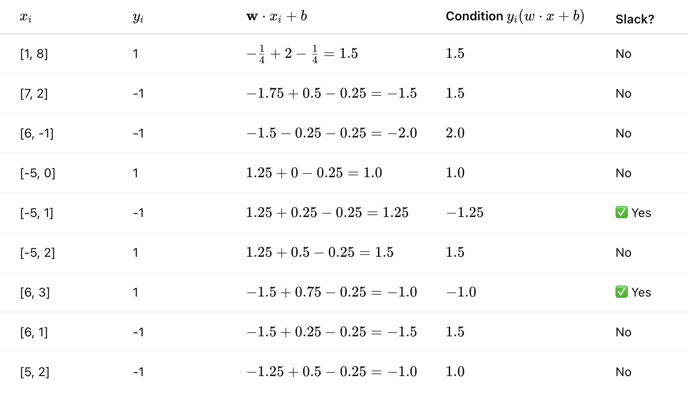

Slack variable formula
For each training point (𝑥𝑖, 𝑦𝑖):
    𝜉𝑖 = max(0, 1 - 𝑦𝑖(𝑤⋅𝑥𝑖 + 𝑏))

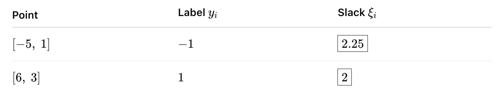

- soft margin   
在 Soft-Margin 中，損失函數與 slack variable 是這樣的關係：
- soft margin loss function
  - L = 1/2 ||w||² + C * Σ𝜉𝑖
  - L(x, y) = max(0, 1 - y * (w⋅x + b)) + C * Σ𝜉𝑖 => 𝜉𝑖 = L(x, y)
  - 其中，C 是正則化參數，控制 slack 的懲罰程度。
  - 這個損失函數的目標是最小化權重向量的平方和，同時對 slack 變數進行懲罰，以允許部分資料點違反 margin 條件。
  因此，hinge loss 本質上就是 slack 的一種衡量。
- kernel trick
- kernel function
- loss function
  - 實務建議
    如果你的資料中有些雜訊或離群值 → 使用 hinge loss（更穩定）
    如果你的資料很乾淨、且你想要模型更嚴格 → 可以考慮 squared hinge loss
  - hinge loss
  如果一筆資料點距離決策邊界超過 margin（也就是 y⋅f(x)≥1），那麼 loss 為 0。
  否則，損失會線性增加，距離邊界越近或分類錯誤，損失越大。
  對於 離群點（outliers） 的懲罰較溫和。
  常常會產生較稀疏（sparse） 的模型（support vector 較少）。
    - Hinge loss is a loss function used in SVMs to maximize the margin between classes.
    - It penalizes misclassified points and those within the margin.
    - The hinge loss for a single point (𝑥𝑖, 𝑦𝑖) is defined as:
      - max(0, 1 - 𝑦𝑖 * (𝑤⋅𝑥𝑖 + 𝑏))
    - This means:
      - If the point is correctly classified and outside the margin, the loss is 0.
      - If it is misclassified or within the margin, the loss increases linearly.
  - Squared hinge loss(p = 2)
  與 hinge loss 類似，但把損失平方了。
  如果一筆資料點距離邊界不夠遠，損失會以平方方式成長。
  對於分類錯誤的資料（尤其離群點），懲罰更大。
  模型會嘗試更嚴格地區分資料，但也可能因此過擬合（overfit）。
    - Squared hinge loss is a variant of hinge loss that squares the margin violation.
    - It is defined as:
      - max(0, 1 - 𝑦𝑖 * (𝑤⋅𝑥𝑖 + 𝑏))²
    - This means:
      - It penalizes misclassified points more heavily than hinge loss, as the penalty grows quadratically with the margin violation.
  - Practical Observations
  
    - Hinge loss is less sensitive to outliers than squared hinge loss.
    - Squared hinge loss can lead to larger gradients for misclassified points, potentially speeding up convergence but also increasing sensitivity to outliers.

## How do C and gamma affect the decision boundary?
C 控制模型對錯誤分類的寬容度，gamma 控制 kernel 對資料點的「影響範圍」與邊界彎曲程度。
兩者需一起調整，決定模型是保守、泛化還是記憶每一點。

C 容錯懲罰參數（Regularization parameter）: 
功能：
控制模型對「錯誤分類」的容忍程度。
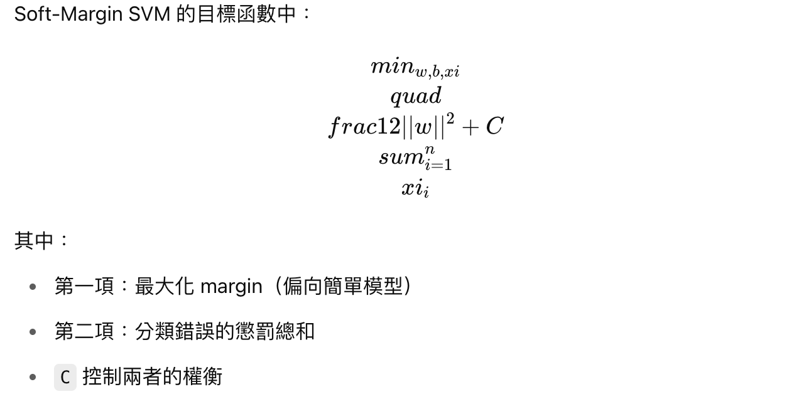
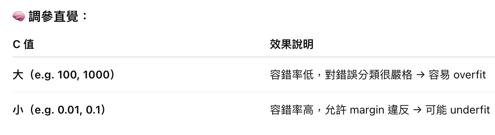
Regularization strength
- Low C → more tolerant of misclassified points (smoother, more generalized boundary)
- High C → less tolerance → more complex boundary, fits training set better

gamma RBF Kernel 的彎曲程度參數 :
功能：
控制每個訓練點的「影響範圍」，也就是Kernel 的感知範圍（範圍大或小）
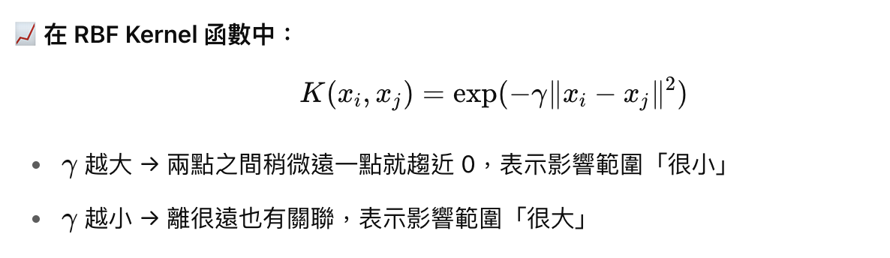
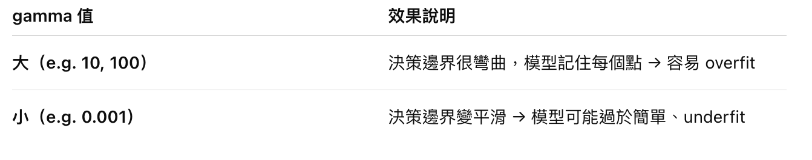
RBF kernel width (inverse of std)	
- Low gamma → broader influence of each point (smoother boundary)
- High gamma → each point only influences nearby region → more wiggly, overfit-prone boundary

## Linear SVM
### Full code example
```python
from sklearn.svm import LinearSVC
import numpy as np

# Given data
X = np.array([[1, 8], [7, 2], [6, -1], [-5, 0], [-5, 1], [-5, 2], [6, 3], [6, 1], [5, 2]])
y = np.array([1, -1, -1, 1, -1, 1, 1, -1, -1])

# Convert labels to +1 / -1 → LinearSVC requires {0,1}, so we map to {0,1}
y_transformed = (y == 1).astype(int)

# Train LinearSVC model with hinge loss (p=1) and C=1
lsvm = LinearSVC(C=1, loss='hinge', max_iter=10000)
lsvm.fit(X, y_transformed)

# Get model parameters
w = lsvm.coef_[0]
b = lsvm.intercept_[0]
print("Weight vector:", w)
print("Bias:", b)

# Plot using the provided utility (assumes this function exists)
linear_plot(X, y, w=w, b=b)
```

## Kernel 方法的幾種常見形式與比較
線性（Linear）
多項式（Polynomial）
高斯/徑向基（RBF / Gaussian）
Sigmoid
使用自定義 kernel 的實例

## SVM 訓練的數值優化方法
拉格朗日乘子法（Lagrangian duality）
SMO（Sequential Minimal Optimization）概念
primal vs. dual 問題的解法

## 處理多分類問題的策略
臉部辨識（如 Eigenfaces 搭配 SVM）
手寫數字辨識（MNIST）
物件偵測（如在特徵空間使用 HOG + SVM）
病理影像分類（醫學影像中的分類應用）
垃圾郵件分類

## 評估指標與模型優化
常見的評估指標包括：
Accuracy
Precision / Recall / F1-score
Confusion Matrix
ROC Curve / AUC
可優化方向：
調整 C 與 gamma
特徵標準化（scaling）
Kernel 選擇與參數調整
使用學習曲線分析 bias/variance tradeoff underfitting / overfitting

## 模型效能評估技巧補充
混淆矩陣（Confusion Matrix）
ROC Curve 與 AUC（針對二元分類）
Precision/Recall Tradeoff
模型學習曲線、偏差-變異分析（bias-variance tradeoff）

## 延伸主題
SVR（Support Vector Regression）
One-Class SVM（異常偵測）
SVM + PCA 降維整合
使用 GPU 加速的 SVM 實作（如 cuML）

## SVM 的優點（Strengths）
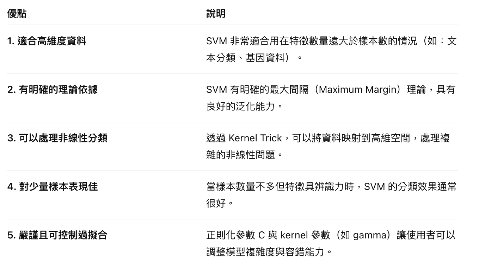

## SVM 的缺點（Limitations）
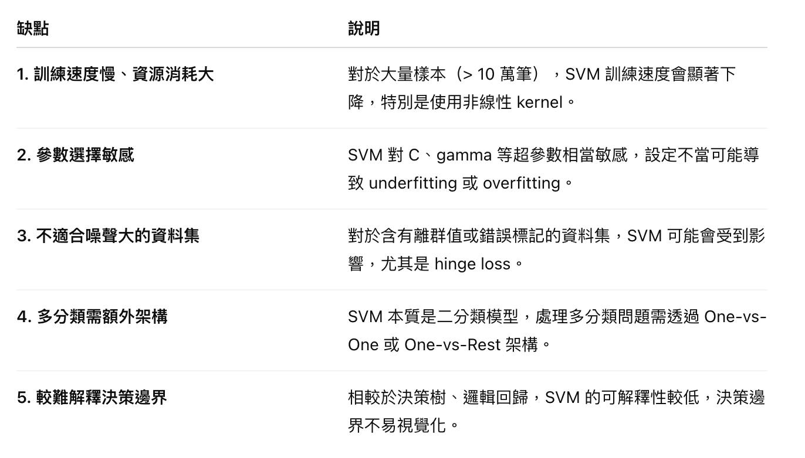

## SVM 適合的資料集特性


## 不建議使用 SVM 的場景
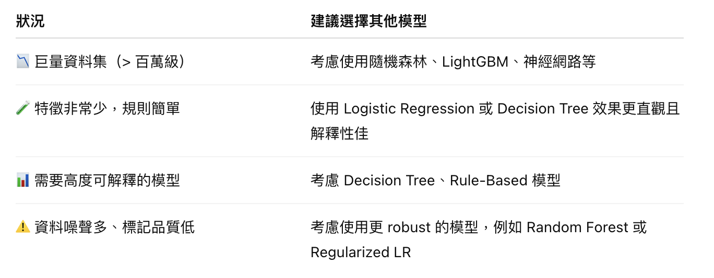
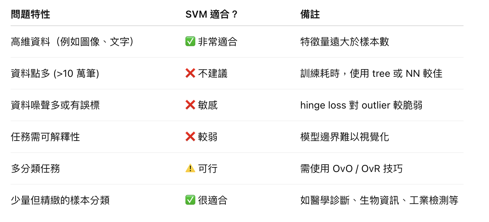

## 與其他模型比較
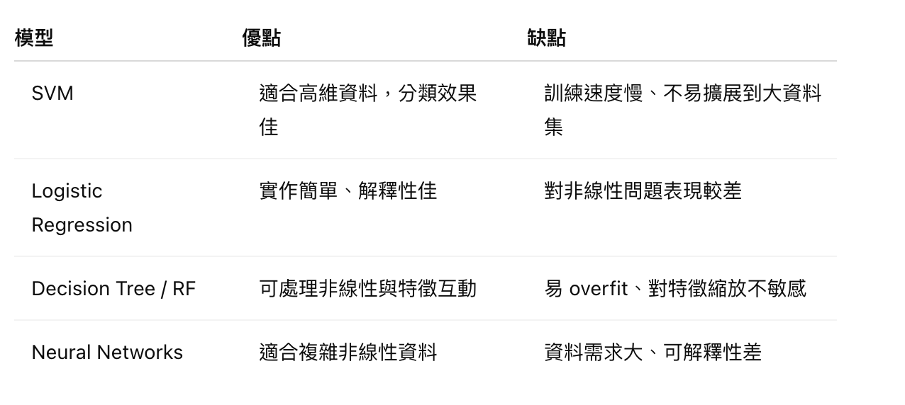

## 適合使用 SVM 的情境
特徵維度高、樣本數中等或偏少的任務
 例：基因表達分析、文字分類、HOG 特徵分類
需要嚴謹邊界與最大化分類間距的任務
 例：異常偵測、瑕疵檢測、安全分類系統
資料具有一定可分性，或能藉由 kernel 映射變可分
 適合使用線性或非線性 SVM（RBF、Polynomial）
希望模型泛化能力強、避免過度擬合時
 適用於 C 與 kernel 可調整的情境
在小樣本情況下仍需穩定分類效果時
 相較於深度學習，SVM 在資料稀少時更穩定

## 不建議使用 SVM 的情境
樣本數非常大（>10 萬筆以上）時
 訓練速度與記憶體需求會顯著上升
特徵數量極少、資料規則簡單可分時
 可考慮用 Logistic Regression、Decision Tree 更快速可解釋
需要模型高度可解釋性或易於呈現決策邏輯時
 SVM 的決策邊界難以直接理解與視覺化
資料標註品質不高或含大量噪聲、離群值時
 SVM（特別是 hinge loss）對這類資料較為敏感
多類別數量過多時（例如數十類以上）
 雖然可以用 One-vs-One 或 One-vs-Rest，但訓練與預測複雜度會快速上升

## 常見錯誤與限制
未標準化特徵（會影響 kernel 計算）
gamma 過大導致 overfitting
C 過小導致 underfitting
資料集過大時，SVM 訓練速度慢（考慮使用近似方法或轉向其他模型）

## 資源與學術資料推薦
📘 書籍：
《Pattern Recognition and Machine Learning》by Christopher Bishop
《Understanding Machine Learning》by Shai Shalev-Shwartz and Shai Ben-David（有詳細推導 SVM 理論）
《Guide to Kernel-based Learning Algorithms》

📄 經典論文：
Cortes & Vapnik (1995): Support-Vector Networks
Dalal & Triggs (2005): Histograms of Oriented Gradients for Human Detection
Osuna, Freund & Girosi: An Improved Training Algorithm for SVMs
Scholkopf’s papers on Kernel PCA 與 One-Class SVM

## References
- [Slack](https://ljalphabeta.gitbooks.io/python-/content/slack.html)
- [GridSearchCV](https://scikit-learn.org/stable/modules/generated/sklearn.model_selection.GridSearchCV.html)
- [Support Vector Machines (SVM): An Intuitive Explanation](https://medium.com/low-code-for-advanced-data-science/support-vector-machines-svm-an-intuitive-explanation-b084d6238106)
- [Recognizing hand-written digits](https://scikit-learn.org/stable/auto_examples/classification/plot_digits_classification.html)
- [What are support vector machines (SVMs) IBM Article](https://www.ibm.com/think/topics/support-vector-machine)